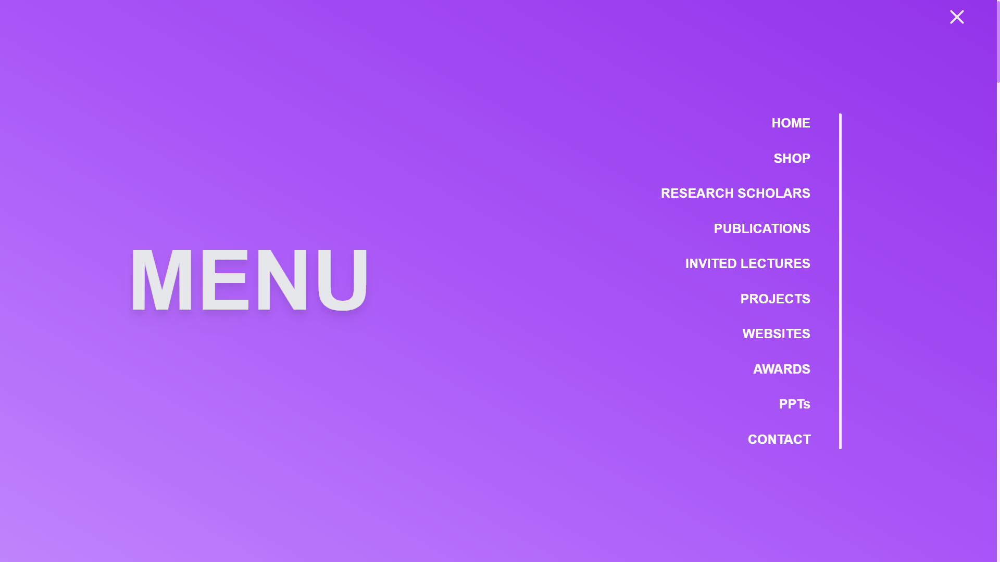
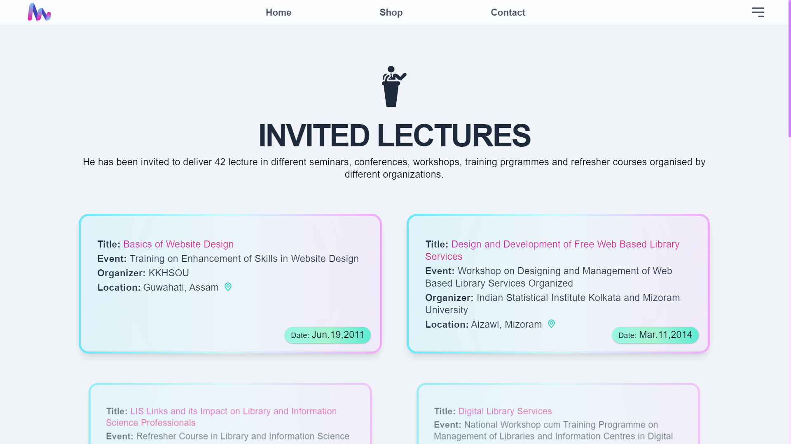
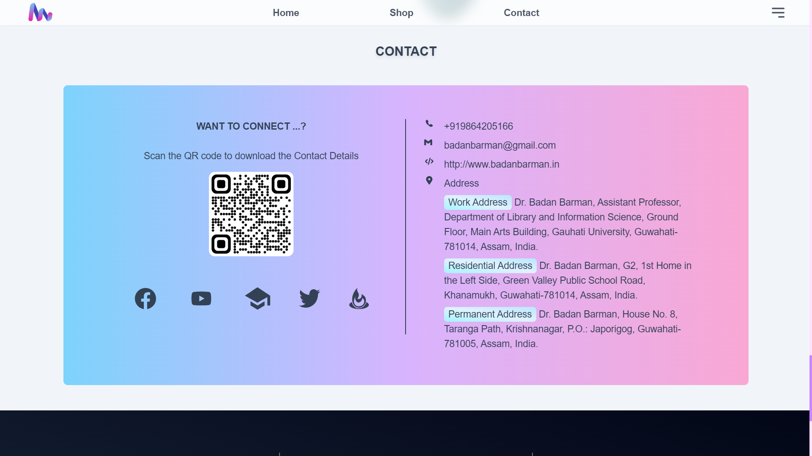
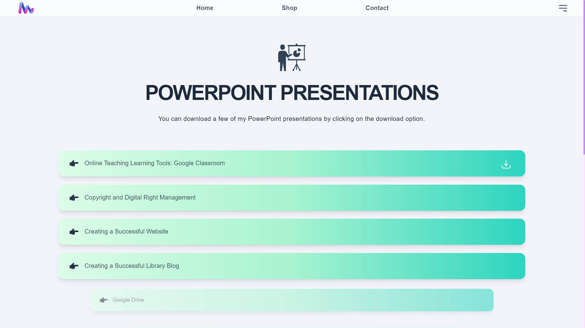
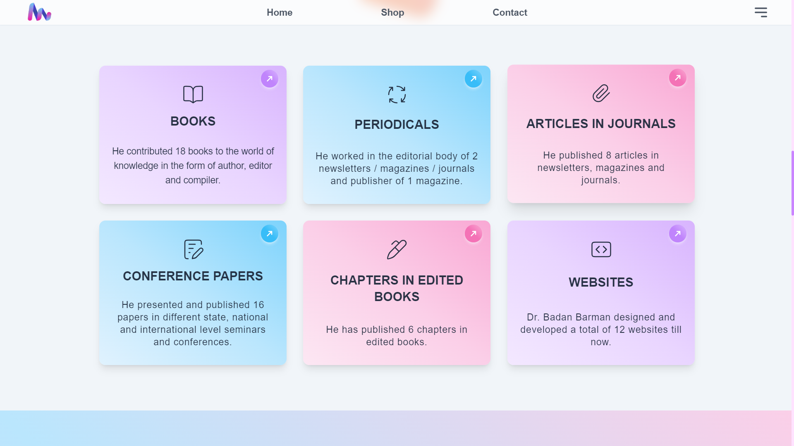
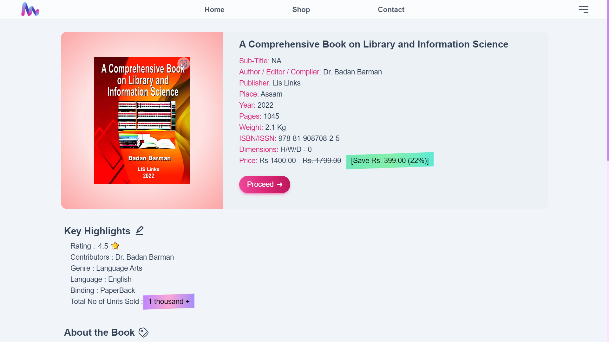
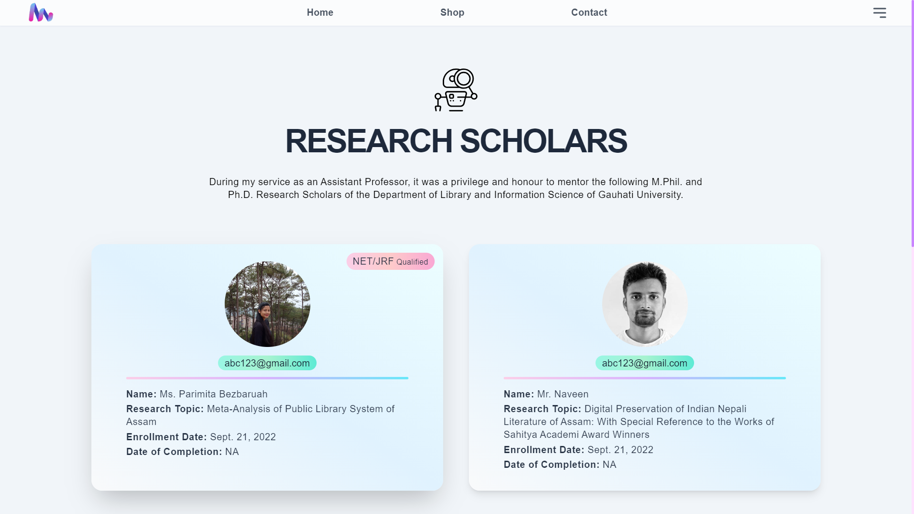
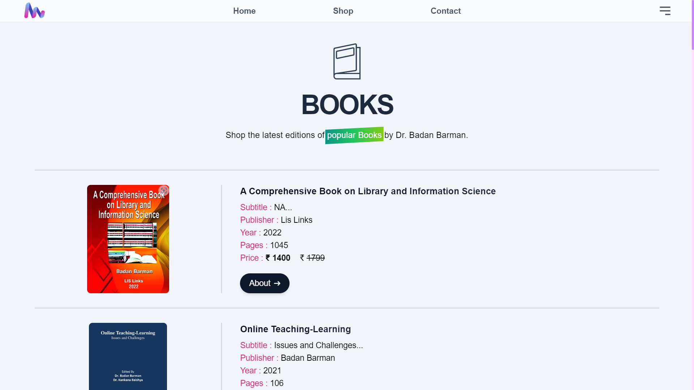

<div style="align:center">
 
</div>
# BADAN BARMAN

 <h4>This is the Personal Portfolio Designed for Dr Badan Barman.</h4>
 

______________________________________________________________________________________
# Software Used
<div>
 
</div>

The project is build with Django. The Database is the ~Sqlite3 which comes in built with the Django Framework,since the amount of data we are dealing with is very small so no external database is implemented.  

It uses GSAP for animations.

Tailwind CSS is used for the styles.


________________________________________________________________________________________
# Usage

#### To get it up and running quickly:
Make sure you have python@latest on your machine.


### The easier method :


> Download the zip file by selecting the branch as master.


> Unzip it and move inside the BadanBarman folder.


> You have to create the environment by typing the below command.

```javascript
$.\env\Scripts\activate
```


> Again move inside the BadanBarman folder.Once you are inside the first BadanBarman folder ,again move into the next BadanBarman folder.


> Now open the powershell or command prompt with the current BadanBarman folder and type the bellow command.


```javascript
$ python3 manage.py runserver
```
This will start the server on 8000
> vist the below link in browser 
```javascript 
$ http://127.0.0.1:8000
 ```

And you are good to go.


### or (other method)
> Copy the Below command if you have git bash installed on your computer.
```javascript
$ git clone https://github.com/Hungryfoxz/BadanBarman.git
```
This will create a folder named Django_poll into your current working directory.
> Now cd into the directory 
```javascript
$ cd BadanBarman
```
Now you will see a directory tree something like this.
>##### BadanBarman


>######    |+......./BadanBarman


>######    |+......./setup


>######    |+......./jstoolchain


>######    |+......./static


>######    |+......./templates


>#####  db.sqlite3


>#####  input.css


>#####  manage.py


>##### env


>##### screenshots


>##### README.md


>##### requirements.txt


> You have to create the environment by typing the below command.

```javascript
$.\env\Scripts\activate
```

> Now cd into the BadanBarman folder 

```javascript
$ cd BadanBarman
```
> Now cd again into the BadanBarman folder 

```javascript
$ cd BadanBarman
```

Now once you are inside the BadanBarman directory just type in the bellow command to start the development server.
> By default it will run on http://127.0.0.1:8000
```javascript
$ python3 manage.py runserver
```


### Default Credentials

Login to the admin panel with this url : 
### http://127.0.0.1:8000/admin


```username :```
> ##### badan


```password :```
> ##### badan@123


After you have successfully logged in , Go to the users table and add New user and select the previledges. Add new admin and password as your choice and give him the 'super-user' access and after the new 'super-user' is created remove the default superuser.


# Working :

#### ```Home/Index page```


> On successfull Completion of the Server setup , You will be greeted with this page.


```Home```
<div style="align:center">
 
</div>


> Some sample images from the site are given below :

```Menu```
<div style="align:center">
 </img>
</div>

>
```Invites Lectures```
<div style="align:center">
 </img>
 </div>

>
 ```Contact```
<div style="align:center">
 </img>
 </div>

>
 ```PPTs```
<div style="align:center">
 </img>
 </div>

>
 ```Publicaitons```
<div style="align:center">
 </img>
 </div>

>
 ```Book Details Page for buying or downloading```
<div style="align:center">
 </img>
 </div>

>
 ```Research Scholars```
<div style="align:center">
 </img>
 </div>

>
 ```Books```
<div style="align:center">
 </img>
 </div>

>
 ```Footer```
<div style="align:center">
 </img>
</div>


### ``` Database area```
> The Database to control all the Tables for inserting data.

>```Websites``` --- It is the table that shows the websites created by BadanBarman.<br/>
>```Research_Scholars``` --- It is the table that shows the Research_Scholars under BadanBarman.<br/>
>```Invited_Lectures``` --- It is the table that shows the Invited_Lectures attended by BadanBarman.<br/>
>```Projects``` --- It is the table that shows the Projects completed by BadanBarman.<br/>
>```Awards``` --- It is the table that shows the Awards achived by BadanBarman.<br/>
>```Presentation``` --- It is the table that shows the Presentation created by BadanBarman.<br/>
>```Articles_In_Journals``` --- It is the table that shows the Articles_In_Journals created by BadanBarman.<br/>
>```Chapters_In_Edited_Books``` --- It is the table that shows the Chapters_In_Edited_Books created by BadanBarman.<br/>
>```Books``` --- It is the table that shows the Books created by BadanBarman.<br/>
>```Periodicals``` --- It is the table that shows the Periodicals created by BadanBarman.<br/>


_________________________________________________________________________________________
## Comments
>
 Building this website was a rewarding journey from concept to code. Initially, ReactJS or SvelteKit were considered, but both necessitated setting up a database like MongoDB or MySQL. Django's built-in SQLite3 database significantly simplified the development process, making it the preferred choice...<br/>

 The design started with the Homepage hero section, and other parts were designed as the project progressed. It is my first Python project where I have incorporated npm for installing JS libraries...<br/>

 The homepage hero section was the most time-consuming, requiring over five days to perfect. Other homepage sections were completed within a day each, while subsequent pages were finished rapidly, averaging one day per page. The entire project was successfully concluded within a month....<br/>

 There were countless instances where my code seemed flawless, yet refused to execute. Frustration mounted, and there were moments when giving up felt like the only option. However, an inner drive propelled me forward, refusing to yield to defeat. Ultimately, perseverance triumphed, and the final product exceeded my expectations, proving that hard work truly pays off.

 ```Fun Fact``` While building my website, I became well-acquainted with www.badanbarman.in. Perhaps a little too well-acquainted, as my frequent visits seem to have inflated the visitor counter by over 8,000! Let's just say I have single-handedly boosted the traffic stats....<br/>


## Acknowledgments
 Many diificulties faced during the projects were tackled thanks to the open source community and stackoverflow.

## See Also

- [`Django Documentation`](https://github.com/noffle/common-readme)
- [`StackOverflow`](https://stackoverflow.com)
- [`GSAP`](https://gsap.com)
- [`Tailwind`](https://tailwindcss.com)

## License

Not Licenced.