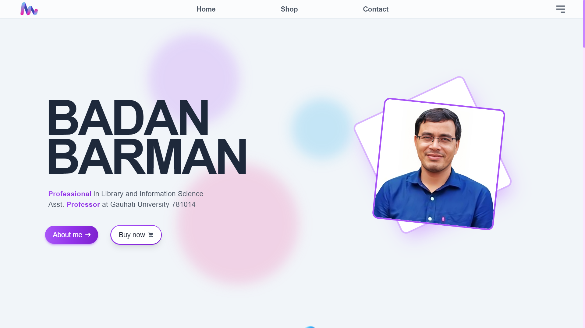
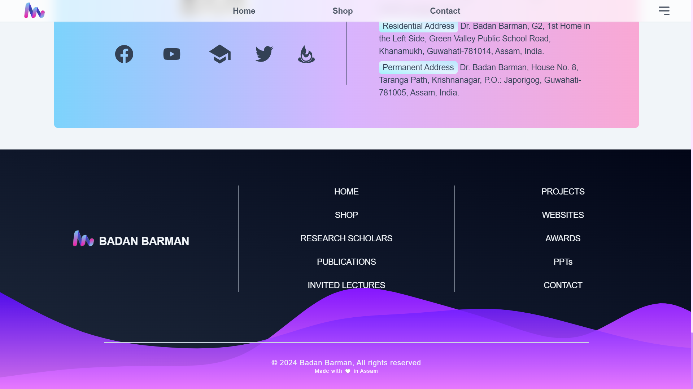

# BADAN BARMAN

<div style="align:center">
 <h4>This is the Personal Portfolio Designed for Dr Badan Barman.</h4>
 
</div>
 

______________________________________________________________________________________
# Software Used
<div>
 
</div>

The project is build with Django. The Database is the ~Sqlite3 which comes in built with the Django Framework,since the amount of data we are dealing with is very small so no external database is implemented.  

It uses GSAP for animations.

Tailwind CSS is used for the styles.


________________________________________________________________________________________
# Usage

#### To get it up and running quickly:
Make sure you have python@latest or above installed on your machine.


### The easier method :


> Download the zip file by selecting the branch as master.


> Unzip it and move inside the BadanBarman folder.


> You have to create the environment by typing the below command.

```javascript
$.\env\Scripts\activate
```


> Again move inside the BadanBarman folder.Once you are inside the first BadanBarman folder ,again move into the next BadanBarman folder.


> Now open the powershell or command prompt with the current BadanBarman folder and type the bellow command.


```javascript
$ python3 manage.py runserver
```
This will start the server on 8000
> vist the below link in browser 
```javascript 
$ http://127.0.0.1:8000
 ```

And you are good to go.


### or (other method)
> Copy the Below command if you have git bash installed on your computer.
```javascript
$ git clone https://github.com/Hungryfoxz/BadanBarman.git
```
This will create a folder named Django_poll into your current working directory.
> Now cd into the directory 
```javascript
$ cd BadanBarman
```
Now you will see a directory tree something like this.
>##### BadanBarman


>######    |+......./BadanBarman


>######    |+......./setup


>######    |+......./jstoolchain


>######    |+......./static


>######    |+......./templates


>######    |+......./db


>######    |+..../input.css


>######    |+..../manage.py


>##### env


>##### screenshots


>##### README.md


>##### requirements.txt


> You have to create the environment by typing the below command.

```javascript
$.\env\Scripts\activate
```

> Now cd into the BadanBarman folder 

```javascript
$ cd BadanBarman
```
> Now cd again into the BadanBarman folder 

```javascript
$ cd BadanBarman
```

Now once you are inside the BadanBarman directory just type in the bellow command to start the development server.
> By default it will run on http://127.0.0.1:8000
```javascript
$ python3 manage.py runserver
```


### Default Credentials

Login to the admin panel with this url : 
### http://127.0.0.1:8000/admin


```username :```
> ##### badan


```password :```
> ##### badan@123


After you have successfully logged in , Go to the users table and add New user and select the previledges. Add new admin and password as your choice and give him the 'super-user' access and after the new 'super-user' is created remove the default superuser.


# Working :

#### ```Home/Index page```


> On successfull Completion of the Server setup , You will be greeted with this page.


```Home```
<div style="align:center">
 
</div>


> Some sample images from the site are given below :

```Menu```
<div style="align:center">
 </img>
</div>

```Invites Lectures```
<div style="align:center">
 </img>
 </div>

 ```Contact```
<div style="align:center">
 </img>
 </div>

 ```PPTs```
<div style="align:center">
 </img>
 </div>

 ```Publicaitons```
<div style="align:center">
 </img>
 </div>

 ```Book Details Page for buying or downloading```
<div style="align:center">
 </img>
 </div>

 ```Research Scholars```
<div style="align:center">
 </img>
 </div>

 ```Books```
<div style="align:center">
 </img>
 </div>

 ```Footer```
<div style="align:center">
 </img>
</div>


### ``` Database area```
> The Database to control all the Tables for inserting data.

>```Websites``` --- It is the table that shows the websites created by BadanBarman.
>```Research_Scholars``` --- It is the table that shows the Research_Scholars under BadanBarman.
>```Invited_Lectures``` --- It is the table that shows the Invited_Lectures attended by BadanBarman.
>```Projects``` --- It is the table that shows the Projects completed by BadanBarman.
>```Awards``` --- It is the table that shows the Awards achived by BadanBarman.
>```Presentation``` --- It is the table that shows the Presentation created by BadanBarman.
>```Articles_In_Journals``` --- It is the table that shows the Articles_In_Journals created by BadanBarman.
>```Chapters_In_Edited_Books``` --- It is the table that shows the Chapters_In_Edited_Books created by BadanBarman.
>```Books``` --- It is the table that shows the Books created by BadanBarman.
>```Periodicals``` --- It is the table that shows the Periodicals created by BadanBarman.


_______________________________________________________________________________________________________________________________________________________________________
## Acknowledgments
 Many diificulties faced during the projects were tackled thanks to the open source community and stackoverflow.

## See Also

- [`Django Documentation`](https://github.com/noffle/common-readme)
- [`StackOverflow`](https://stackoverflow.com)
- [`GSAP`](https://gsap.com)
- [`Tailwind`](https://tailwindcss.com)

## License

Not Licenced.